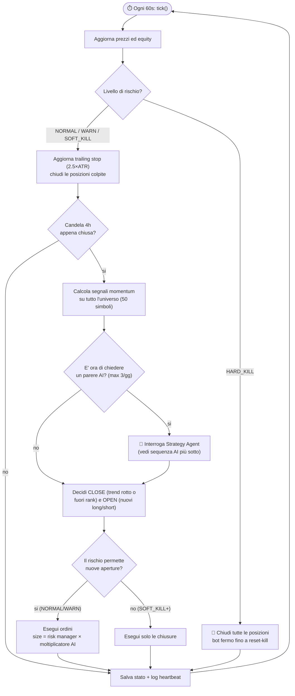
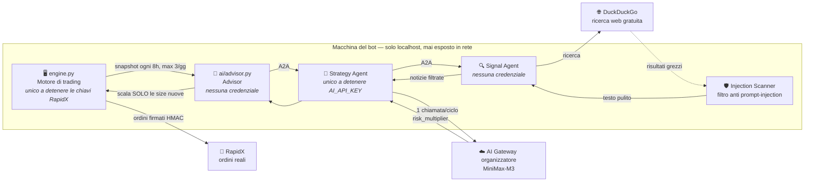
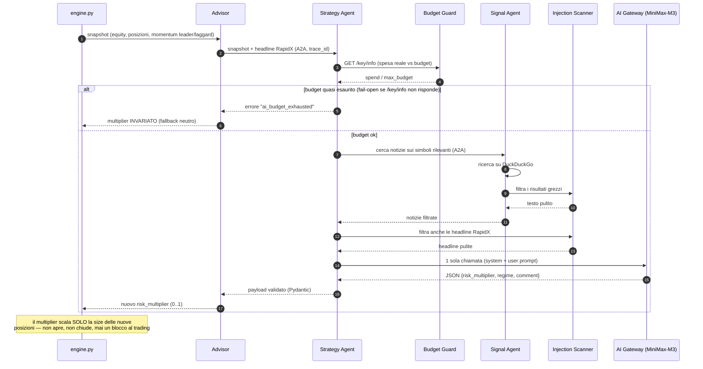

<p align="center">
  
</p>

# Cephelo_AITrader — Bot per Liquidity Arena 2026 (Track A, Phase I)

> *Cephelo: capo carovana dei Rover, il popolo mercante di Shannara — commercia qualsiasi cosa,
> non fa niente gratis e ha un fiuto infallibile per il profitto.*

Bot di trading algoritmico per la competizione, costruito attorno ai vincoli di gara:

| Vincolo di gara | Come lo gestisce il bot |
|---|---|
| Ordini via RapidX, 1 scrittura / 5 s | Client REST con rate limiter bloccante per endpoint ([rate_limiter.py](aitrade/rate_limiter.py)) |
| Solo 50 perpetual Binance in whitelist | Universo fisso in [symbols.py](aitrade/symbols.py), esclusioni da config |
| Leva max 2x | Leva impostata a 2x, esposizione lorda cap a 1.5x equity |
| **Squalifica a Max Drawdown 20%** (Fase I) | Kill-switch a 3 livelli: 8% (size dimezzate) → 12% (no nuove posizioni) → 15% (chiudi tutto e fermati) |
| **Liquidazione forzata a equity<800/NAV<0.8** (Fase II) | Stesso kill-switch, soglie fisse invece che drawdown dal picco: 900 → 850 → 800. Attivare con `risk.phase: 2` in config.yaml *solo* quando l'organizzatore annuncia il passaggio — vedi [risk.py](aitrade/risk.py) |
| Solo AI API dell'organizzatore, 10 $/giorno | Advisor opzionale con budget di chiamate giornaliero ([advisor.py](aitrade/ai/advisor.py)) |
| Uptime ≥ 90% | Loop che non muore mai, stato persistente, wrapper di riavvio [run.ps1](run.ps1) |
| Conferma stato dopo ogni scrittura | Ogni ordine viene verificato via `clientOrderId`; niente retry alla cieca |

**Strategia**: momentum cross-sectional su barre 4h — long sui più forti in trend rialzista,
short sui più deboli in trend ribassista, sizing vol-targeted (ATR), trailing stop 2.5×ATR.
Punteggio gara = Return + Sharpe + MDD + Win Rate: il backtest riporta esattamente queste metriche.

Backtest sui 250 giorni fino al 13/7/2026 (46 simboli, fee e slippage inclusi):
**+26.2%, Sharpe 2.35, MDD 10.1%** — ⚠️ parametri scelti in-sample: è una baseline, non una promessa.

## Setup

Richiede **Python >= 3.11** (per il framework degli agenti AI).

```powershell
pip install -r requirements.txt
copy .env.example .env        # poi compila le chiavi quando le ricevi
```

L'installazione include il [BeeAI Framework](https://github.com/i-am-bee/beeai-framework)
(agenti + protocollo A2A + adapter MiniMax), LangChain (ricerca DuckDuckGo) e
`transformers`/`torch` (classificatore locale anti prompt-injection): il
download puo' richiedere qualche minuto e qualche centinaio di MB in piu'
rispetto al solo bot di trading. Tutto questo serve solo all'AI advisor
opzionale (`ai.enabled`) — il bot funziona in paper/backtest/live anche
senza, o se questi pacchetti non sono installati.

## Comandi

```powershell
python -m aitrade download-data          # scarica lo storico 4h (cache in data_cache/)
python -m aitrade backtest               # backtest con le metriche di gara
python -m aitrade backtest --refresh     # idem, riscaricando lo storico
python -m aitrade run --mode paper       # paper trading su prezzi reali (nessuna chiave richiesta)
python -m aitrade run --mode live        # trading live su RapidX (richiede .env)
python -m aitrade status                 # equity, drawdown, posizioni, stato AI
python -m aitrade close-all --yes        # EMERGENZA: chiude tutte le posizioni
python -m aitrade reset-kill             # riattiva il bot dopo un hard-kill
python -m aitrade ai-budget              # spesa reale sull'AI Gateway (GET /key/info)
.\run.ps1                                # avvio con riavvio automatico (uptime)
```

Test: `python -m pytest tests/ -q` (se fallisce all'avvio per plugin estranei:
`$env:PYTEST_DISABLE_PLUGIN_AUTOLOAD="1"` prima del comando).

## Architettura

```
aitrade/
├── config.py            carica config/config.yaml + .env
├── symbols.py           whitelist 50 coppie, conversioni RapidX<->Binance
├── rate_limiter.py      bucket per i limiti di gara (1 ordine/5s ecc.)
├── rapidx/
│   ├── auth.py          firma HMAC-SHA256 (schema documentato dall'advanced API)
│   └── rest.py          tutti gli endpoint REST (ordini, posizioni, account, news)
├── data/klines.py       candele: RapidX se disponibile, fallback Binance pubblico
├── strategy/momentum.py segnali long/short cross-sectional + isteresi di uscita
├── risk.py              drawdown kill-switch, sizing vol-targeted, trailing stop
├── portfolio.py         stato persistente (JSON) + trade log (CSV)
├── broker/
│   ├── paper.py         fill simulati (fee+slippage) su prezzi reali
│   └── rapidx_live.py   ordini veri: LIMIT IOC marketable + fallback MARKET
├── ai/
│   ├── advisor.py       client A2A verso lo Strategy Agent (mai l'AI Gateway direttamente)
│   └── news.py          news feed della piattaforma RapidX
├── agents/              Signal Agent + Strategy Agent (BeeAI, A2A, localhost) — vedi sotto
├── engine.py            loop principale (paper e live)
└── backtest.py          stesso codice strategia/rischio su dati storici
```

Paper, live e backtest usano **la stessa strategia e lo stesso risk manager**: quello
che testi è quello che gira.

### Il ciclo di un tick (ogni 60 secondi)



## Agenti AI (Signal + Strategy, opzionale)

L'AI advisor non parla piu' direttamente con l'AI Gateway: e' diviso in due
piccoli agenti [BeeAI](https://github.com/i-am-bee/beeai-framework), avviati
come processi separati e raggiunti via protocollo **A2A su localhost**
(mai esposti in rete). Il principio guida e' la separazione dei privilegi:
ogni processo detiene solo le credenziali che gli servono, e nessuno dei due
agenti AI puo' mai toccare denaro.

### Vista d'insieme



- **Signal Agent** (`agents/signal_agent.py`): ricerca web + news via
  LangChain/DuckDuckGo (gratuita, nessuna chiave). Non genera nulla, non
  detiene credenziali — la sua unica responsabilita' e' passare al filtro
  prompt-injection locale (`agents/injection_scanner.py`, un classificatore
  HuggingFace che gira in CPU) tutto il testo esterno prima di restituirlo.
- **Strategy Agent** (`agents/strategy_agent.py`): l'unico posto che detiene
  `AI_API_KEY`/`AI_API_BASE_URL`/`AI_MODEL` e chiama l'AI Gateway
  dell'organizzatore (adapter MiniMax nativo di BeeAI). Interroga il Signal
  Agent (passandogli i **simboli veri** — leader di momentum + posizioni
  aperte — non un blob di snapshot troncato: verificato in produzione che
  quest'ultimo non trovava mai risultati su DuckDuckGo), scansiona anche le
  headline della piattaforma RapidX (difesa in profondita'), e fa **una sola
  chiamata al modello per valutazione**. L'output e' JSON richiesto
  esplicitamente nel prompt e validato manualmente (regex + Pydantic) — non
  il meccanismo `response_format` nativo di BeeAI, che con MiniMax-M3
  (modello "reasoning": ragionamento esteso in `reasoning_content` prima
  della risposta in `content`) falliva sistematicamente in produzione.
- **Advisor** (`ai/advisor.py`, nel processo principale): client leggero
  che interroga lo Strategy Agent via A2A. Non detiene ne' le credenziali
  RapidX (quelle restano solo in `engine.py`) ne' quelle dell'AI Gateway.

### Sequenza di una valutazione

Cosa succede davvero, passo per passo, quando scatta una valutazione AI
(al massimo ogni 8 ore, 3 volte al giorno) — incluso cosa succede quando
qualcosa va storto:



Qualunque punto della catena puo' fallire (agente giu', timeout, JSON fuori
schema, budget esaurito): in ogni caso il risultato e' lo stesso, il
multiplier resta quello del ciclo precedente e il bot continua a tradare da
solo. L'AI e' un miglioramento opzionale, mai un punto di rottura.

**Controllo budget reale** (`agents/budget_guard.py`): il conteggio locale
(`max_calls_per_day`) non vede i retry sullo schema ne' le chiamate di
eventuali compagni di squadra sulla stessa chiave — solo l'organizzatore sa
la spesa vera. Prima di ogni chiamata, lo Strategy Agent interroga
`GET {AI_API_BASE_URL}/key/info`: se `spend` supera `budget_safety_margin`
(default 90% di `max_budget`, in `config.yaml`) la chiamata viene saltata
con errore esplicito invece di rischiare di sforare. A differenza del resto
della pipeline questo controllo e' fail-*aperto*: se `/key/info` non
risponde, si procede comunque (il costo di bloccare per errore e' peggiore
del costo di un tentativo in piu'). Controllo manuale in qualsiasi momento:
`python -m aitrade ai-budget`.

**Correlazione decisione-AI <-> ordine** (richiesta dal regolamento: "the
Organizer will verify AI usage by analyzing the correlation between AI
decision logs and executed trading orders"): ogni trade **OPEN** in
`state/trades.csv` porta le colonne `ai_multiplier`/`ai_trace_id` con il
multiplier e il trace_id in vigore in quel momento (join diretto con
`logs/traces.jsonl` per il ciclo di valutazione completo). I trade **CLOSE**
le lasciano vuote per costruzione — l'AI non tocca mai le uscite, e il log
lo dimostra invece di limitarsi ad affermarlo.

Avvio: `python -m aitrade.agents.run_agents` (gia' incluso in `run.ps1`).
Se questi processi non partono o muoiono, il bot principale continua
normalmente senza il multiplier AI.

## Mappa del codice

Un modulo, una responsabilità: nessun file supera le ~380 righe. **3395 righe
Python** in `aitrade/`, coperte da 17 file di test in `tests/`.

<details>
<summary><code>aitrade/</code> — 10 file, 1483 righe</summary>

| File | Righe | Cosa fa |
|---|---:|---|
| `engine.py` | 379 | loop principale, orchestrazione paper/live |
| `backtest.py` | 193 | stessa strategia/rischio su dati storici |
| `risk.py` | 178 | kill-switch drawdown/equity floor, sizing, trailing stop |
| `config.py` | 177 | carica config.yaml + .env |
| `main.py` | 177 | CLI entrypoint |
| `portfolio.py` | 147 | stato persistente JSON + trade log CSV |
| `telegram_status_bot.py` | 95 | bot Telegram per stato remoto |
| `rate_limiter.py` | 51 | bucket per i limiti di gara (1 ordine/5s) |
| `alerts.py` | 49 | notifiche webhook/Telegram su transizioni kill-switch |
| `symbols.py` | 37 | whitelist 50 coppie, conversioni RapidX↔Binance |

</details>

<details>
<summary><code>agents/</code> — 8 file, 789 righe (BeeAI / A2A)</summary>

| File | Righe | Cosa fa |
|---|---:|---|
| `strategy_agent.py` | 274 | unico detentore chiavi AI Gateway, valutazione regime |
| `signal_agent.py` | 153 | ricerca web/news (LangChain/DuckDuckGo) su simboli veri |
| `injection_scanner.py` | 77 | classificatore HuggingFace anti prompt-injection |
| `tracing.py` | 75 | trace_id e log delle chiamate AI |
| `budget_guard.py` | 70 | controllo spesa reale via GET /key/info |
| `envelope.py` | 68 | validazione scambi A2A |
| `run_agents.py` | 53 | avvio processi Signal Agent + Strategy Agent |
| `schemas.py` | 19 | modelli Pydantic condivisi |

</details>

<details>
<summary><code>broker/</code> — 3 file, 396 righe</summary>

| File | Righe | Cosa fa |
|---|---:|---|
| `rapidx_live.py` | 266 | ordini reali: LIMIT IOC marketable + fallback MARKET |
| `paper.py` | 86 | fill simulati (fee+slippage) su prezzi reali |
| `base.py` | 44 | interfaccia broker astratta |

</details>

<details>
<summary><code>rapidx/</code> — 2 file, 245 righe</summary>

| File | Righe | Cosa fa |
|---|---:|---|
| `rest.py` | 204 | tutti gli endpoint REST (ordini, posizioni, account, news) |
| `auth.py` | 41 | firma HMAC-SHA256 |

</details>

<details>
<summary><code>ai/</code> — 2 file, 154 righe</summary>

| File | Righe | Cosa fa |
|---|---:|---|
| `advisor.py` | 115 | client verso Strategy Agent (mai l'AI Gateway diretto) |
| `news.py` | 39 | news feed della piattaforma RapidX |

</details>

<details>
<summary><code>strategy/</code> — 2 file, 180 righe</summary>

| File | Righe | Cosa fa |
|---|---:|---|
| `momentum.py` | 149 | segnali long/short cross-sectional + isteresi di uscita |
| `indicators.py` | 31 | EMA, ATR e altri indicatori tecnici |

</details>

<details>
<summary><code>data/</code> — 1 file, 144 righe</summary>

| File | Righe | Cosa fa |
|---|---:|---|
| `klines.py` | 144 | candele: RapidX se disponibile, fallback Binance pubblico |

</details>

Test (`tests/`, uno per modulo principale): `agents_envelope`, `ai_advisor`,
`ai_agents_beeai`, `ai_budget_guard`, `ai_injection_scanner`, `ai_schemas`,
`alerts`, `auth`, `backtest`, `engine_alerts`, `paper_broker`, `portfolio`,
`rapidx_live`, `rate_limiter`, `risk`, `strategy`, `telegram_status_bot`.

## Roadmap gara (date dall'email del comitato)

1. **Subito**: crea il sub-portfolio su RapidX (Assets → Trading → RapidX → +Portfolio)
   e rispondi all'email con l'ID per ricevere i fondi di test.
2. **Appena hai le chiavi** (fase di test, entro il 18/7): mettile nel `.env` e verifica
   l'integrazione live — vedi checklist sotto. I portfolio di test chiudono il **18 luglio**.
3. **Entro il 18/7**: arrivano gli AI token → compila `AI_API_KEY`/`AI_API_BASE_URL`/`AI_MODEL`
   e attiva `ai.enabled: true` nel config.
4. **Dal 20/7**: gara sul main portfolio. Fai girare il bot su una macchina sempre accesa.

## Checklist di verifica live (fase di test — IMPORTANTE)

I docs pubblici non mostrano i payload completi delle risposte, quindi il parsing è
difensivo ma **va verificato con le chiavi di test**:

- [ ] `python -m aitrade status` dopo un giro live: l'equity viene letta bene da
      `GET /trading/account`? (se vedi `equity=0` guarda il log: c'è il payload raw)
- [ ] Il formato posizioni di `GET /trading/position` (campi qty/entryPrice) è corretto?
- [ ] L'endpoint klines RapidX risponde su `rapidx.klines_path`? (se no, il bot usa
      Binance pubblico in automatico — funziona comunque)
- [ ] Un ordine di prova piccolo viene piazzato, confermato via `clientOrderId` e chiuso?
- [ ] `set_leverage` a 2x funziona sui simboli?
- [ ] Confronta la firma HMAC con la CLI ufficiale se ricevi errori 1004/2002:
      `npm install -g @liquiditytech/rapidx-cli@latest` (repo skill: LiquidityTech/ltp-rapidx-skill su GitHub)

## Notifiche su SOFT_KILL / HARD_KILL (opzionale)

Senza configurazione, l'unico modo per accorgersi che il bot ha attivato il
kill-switch è controllare `status` a mano. Il bot supporta due canali
indipendenti (si possono usare anche insieme) che mandano un messaggio
automatico non appena si **entra** in SOFT_KILL o HARD_KILL (una volta sola
per transizione, non ad ogni tick). Vuoto = nessuna notifica su quel canale,
comportamento di default. Vedi [alerts.py](aitrade/alerts.py).

**Webhook (Discord/Slack)**: imposta `ALERT_WEBHOOK_URL` nel `.env` — per
Discord: Impostazioni canale → Integrazioni → Webhook, copia l'URL.

**Telegram (notifica sul cellulare)**:
1. Scrivi a [@BotFather](https://t.me/BotFather) su Telegram, invia `/newbot`
   e segui le istruzioni: ottieni un token tipo `123456789:AAExxxxxxx`.
   Salvalo in `TELEGRAM_BOT_TOKEN` nel `.env`.
2. Apri una chat col tuo nuovo bot e invia un qualsiasi messaggio (es. `/start`)
   — Telegram non fa arrivare messaggi a un bot a cui non hai mai scritto.
3. Recupera il tuo `chat_id` visitando nel browser
   `https://api.telegram.org/bot<TOKEN>/getUpdates` (sostituendo `<TOKEN>`)
   subito dopo il passo 2: cerca il campo `"chat":{"id": ...}` nella risposta
   JSON. Salvalo in `TELEGRAM_CHAT_ID` nel `.env`.
4. Riavvia il bot: da quel momento SOFT_KILL/HARD_KILL arrivano anche come
   messaggio Telegram.

## Stato del portafoglio via Telegram (opzionale)

Con `TELEGRAM_BOT_TOKEN`/`TELEGRAM_CHAT_ID` gia' configurati (vedi sopra),
scrivendo `status` (o `/status`) nella chat col bot arriva come risposta lo
stesso report di `python -m aitrade status`: equity, drawdown, hard-kill,
valutazione AI corrente, posizioni aperte con stop. Vedi
[telegram_status_bot.py](aitrade/telegram_status_bot.py).

E' un processo separato dal bot di trading (non tocca `engine.py`): se non
parte o si ferma, il trading continua normale, si perde solo la possibilita'
di chiedere lo stato via Telegram. Risponde solo ai messaggi provenienti dalla
chat autorizzata (`TELEGRAM_CHAT_ID`) — chiunque altro scriva al bot viene
ignorato in silenzio.

Avvio: `python -m aitrade.telegram_status_bot` (in produzione va messo in un
servizio systemd a parte, es. `cephelo-telegram.service`, accanto a
`cephelo-bot.service` e `cephelo-agents.service`).

## Note operative

- **Uptime ≥ 90%**: un laptop che va in sleep ti squalifica. Usa `.\run.ps1` + disattiva
  sospensione, o meglio un VPS (anche il piano più economico basta: il bot fa poche
  richieste al minuto). Valuta anche di spostare il progetto fuori da OneDrive per la gara:
  la sincronizzazione può bloccare i file di stato.
- **Parametri**: tutti in [config/config.yaml](config/config.yaml). I default vengono da uno
  sweep su 250 giorni: prima della gara rifai `backtest --refresh` e ricontrolla che il MDD
  resti sotto il 12% con dati aggiornati.
- **AI advisor**: scala solo la size delle nuove posizioni (0..1), mai le uscite. Se lo
  Strategy Agent non risponde (o non e' avviato) il bot continua da solo. L'unica AI
  generativa usata e' MiniMax-M3 via l'AI Gateway dell'organizzatore (vedi sezione
  "Agenti AI" sopra) — non usare API AI di terze parti: squalifica.
- **Log**: `logs/aitrade.log` (rotante), trade in `state/trades.csv`, stato in `state/state.json`.
  Gli agenti AI (`agents/run_agents.py`) loggano su stdout del proprio processo.
